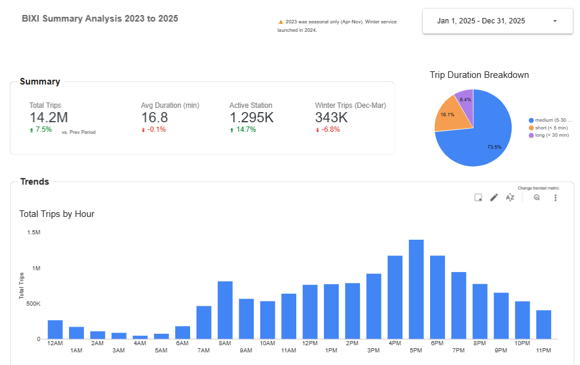

# Bixi Analytics

End-to-end analytics pipeline for [Bixi](https://bixi.com) Montreal bike-share data.
Covers data ingestion from GCS to BigQuery, and SQL transformations with dbt.

## Dashboard

[](https://datastudio.google.com/reporting/59a4f383-8918-4ac7-928b-b32a6eedc802)

[View the live dashboard](https://datastudio.google.com/reporting/59a4f383-8918-4ac7-928b-b32a6eedc802) — 3 pages: usage summary, winter analysis, and station rebalancing.

## Architecture

```text
Bixi open data (CSV)
        ↓
Google Cloud Storage (raw CSVs)
        ↓  ingestion/
BigQuery — dataset: raw
        ↓  dbt/
BigQuery — dataset: analytics
        ↓
BI / analysis tools
```

## Project structure

```text
├── ingestion/               # Python scripts to load raw data into BigQuery
│   ├── upload_to_gcs.py     # Upload local CSVs to GCS
│   └── load_to_bigquery.py  # Load GCS files into BigQuery raw dataset
│
├── dbt/bixi/                # dbt transformation project
│   ├── models/
│   │   ├── staging/         # Cleaning & unioning raw tables (views)
│   │   └── marts/           # Analytics-ready tables
│   └── README.md            # dbt-specific docs
│
├── .env                     # GCP project & bucket config (not committed)
└── requirements.txt         # Python dependencies
```

## dbt models

| Model | Type | Description |
|---|---|---|
| `stg_trips` | view | Cleans and unions raw trip data across all years |
| `fct_trips` | table | One row per trip with time dimensions and duration buckets |
| `agg_stations` | table | Departures, arrivals, and net flow per station per year |
| `fct_winter` | table | Winter season trips (Dec–Mar) for winters 2024 and 2025 |

## Setup

**Requirements:** Python 3.12+, GCP project with BigQuery and GCS enabled.

```bash
pip install -r requirements.txt
```

Create a `.env` file at the root:
```
PROJECT_ID=your-gcp-project
BUCKET_NAME=your-gcs-bucket
```

**Load raw data:**
```bash
python ingestion/upload_to_gcs.py   # upload CSVs to GCS
python ingestion/load_to_bigquery.py # load into BigQuery raw dataset
```

**Run dbt:**
```bash
cd dbt/bixi
dbt run       # build all models
dbt test      # run data quality tests
dbt docs generate && dbt docs serve  # browse documentation
```

## Data source

Raw trip data is published annually by Bixi Montreal as open data.
Each year contains one row per trip with start/end station, timestamps in milliseconds, and coordinates.
